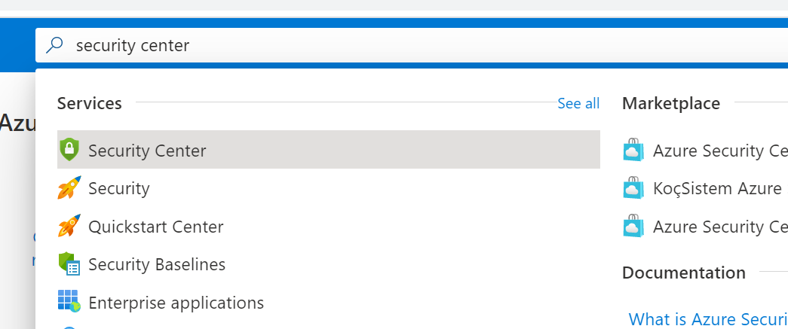
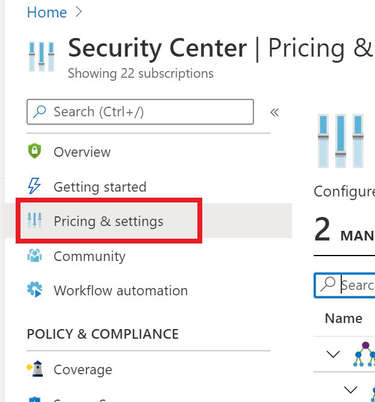
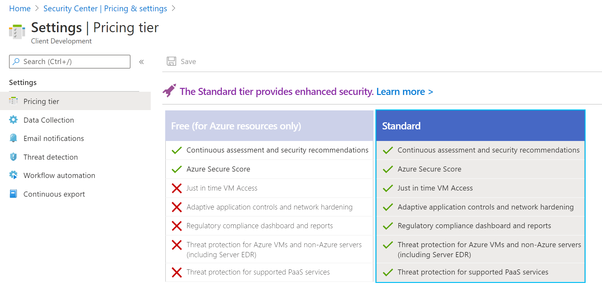
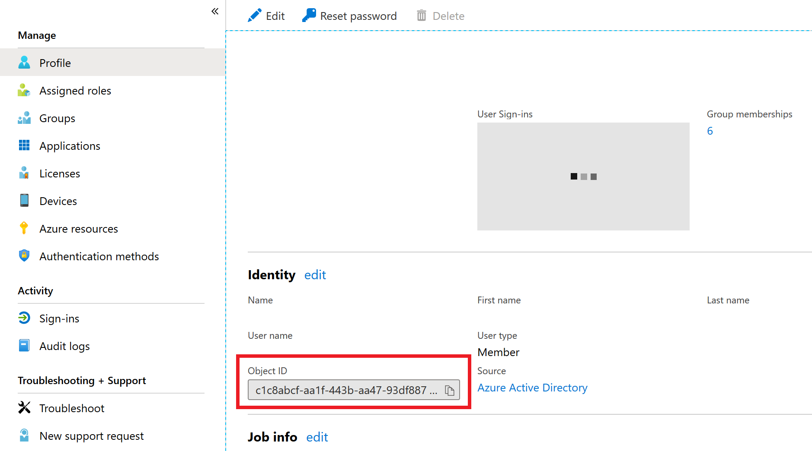
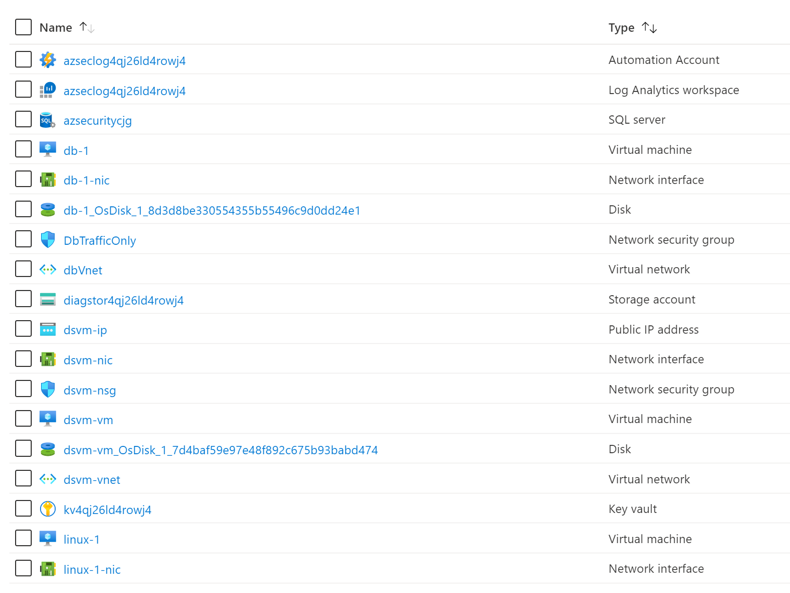
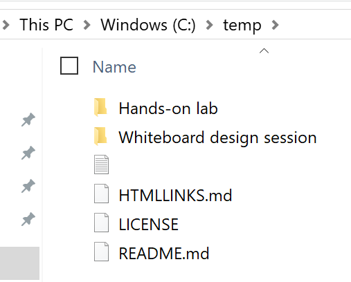

Security baseline on Azure

Before the hands-on lab setup guide

July 2020

Information in this document, including URL and other Internet Web site references, is subject to change without notice. Unless otherwise noted, the example companies, organizations, products, domain names, e-mail addresses, logos, people, places, and events depicted herein are fictitious, and no association with any real company, organization, product, domain name, e-mail address, logo, person, place or event is intended or should be inferred. Complying with all applicable copyright laws is the responsibility of the user. Without limiting the rights under copyright, no part of this document may be reproduced, stored in or introduced into a retrieval system, or transmitted in any form or by any means (electronic, mechanical, photocopying, recording, or otherwise), or for any purpose, without the express written permission of Microsoft Corporation.

Microsoft may have patents, patent applications, trademarks, copyrights, or other intellectual property rights covering subject matter in this document. Except as expressly provided in any written license agreement from Microsoft, the furnishing of this document does not give you any license to these patents, trademarks, copyrights, or other intellectual property.

The names of manufacturers, products, or URLs are provided for informational purposes only and Microsoft makes no representations and warranties, either expressed, implied, or statutory, regarding these manufacturers or the use of the products with any Microsoft technologies. The inclusion of a manufacturer or product does not imply endorsement of Microsoft of the manufacturer or product. Links may be provided to third party sites. Such sites are not under the control of Microsoft and Microsoft is not responsible for the contents of any linked site or any link contained in a linked site, or any changes or updates to such sites. Microsoft is not responsible for webcasting or any other form of transmission received from any linked site. Microsoft is providing these links to you only as a convenience, and the inclusion of any link does not imply endorsement of Microsoft of the site or the products contained therein.

© 2020 Microsoft Corporation. All rights reserved.

Microsoft and the trademarks listed at <https://www.microsoft.com/en-us/legal/intellectualproperty/Trademarks/Usage/General.aspx> are trademarks of the Microsoft group of companies. All other trademarks are property of their respective owners.

**Contents**

<!-- TOC -->

- [Security baseline on Azure before the hands-on lab setup guide](#security-baseline-on-azure-before-the-hands-on-lab-setup-guide)
  - [Requirements](#requirements)
  - [Before the hands-on lab](#before-the-hands-on-lab)
    - [Task 1: Configure Azure Security Center](#task-1-configure-azure-security-center)
    - [Task 2: Deploy resources to Azure](#task-2-deploy-resources-to-azure)
    - [Task 3: Download Google Chrome](#task-3-download-google-chrome)
    - [Task 4: Download SQL Server Management Studio](#task-4-download-sql-server-management-studio)
    - [Task 5: Download GitHub resources](#task-5-download-github-resources)

<!-- /TOC -->

# Security baseline on Azure before the hands-on lab setup guide

## Requirements

1. Microsoft Azure subscription must be pay-as-you-go or MSDN.

    - Trial subscriptions will not work.

2. A machine with the following software installed (a Virtual Machine is created via the ARM template with most of this):

    - [Visual Studio 2019](https://visualstudio.microsoft.com/downloads/)
    - [SQL Management Studio](https://docs.microsoft.com/en-us/sql/ssms/download-sql-server-management-studio-ssms)
    - [Power BI Desktop](https://powerbi.microsoft.com/en-us/downloads/)

3. An Office 365 email account or other email-based account.

## Before the hands-on lab

Duration: 30 minutes

Synopsis: In this exercise, you will set up your environment for use in the rest of the hands-on lab. You should follow all the steps provided in the Before the Hands-on Lab section to prepare your environment *before* attending the workshop.

### Task 1: Configure Azure Security Center

1. Open the [Azure Portal](https://portal.azure.com).

2. In the search box, type **Security Center**, then select it

    

3. In the blade menu, select **Pricing & Settings**, then select the subscription you are running the labs in

    

4. If not already set, update the pricing tier to be **Standard**, then select **Save**

    

5. In the blade menu, select **Data Collection**

    

6. Toggle the **Auto Provisioning** to **Off**

> **NOTE** Auto-provisioning is turned off for purposes of this lab, it is highly recommended that auto-provisioning is set to "on" in a production environment to ensure they security controls are applied.

### Task 2: Deploy resources to Azure

1. Select **Resource groups**.

2. Select **+Add**.

3. Type a resource group name, such as **azsecurity-\[your initials or first name\]**.

4. Select **Review + Create**, then select **Create**.

5. Select **Refresh** to see your new resource group displayed and select it. It may take a few minutes.

6. Select **Create a resource**, search for **template**, select **Template deployment (deploy using custom template)**, then select **Create**

7. Select **Build your own template in the editor**

8. Copy the contents of the [ARM template](https://raw.githubusercontent.com/microsoft/MCW-Security-baseline-on-Azure/master/Hands-on%20lab/Scripts/template.json) from the repo and then paste the ARM template into the window.

9. Select **Save**, you will see the dialog with the input parameters. Fill out the form:

    - Subscription: Select your **subscription**.

    - Resource group: Use an existing Resource group, or create a new one by entering a unique name, such as **azsecurity-\[your initials or first name\]**.

    - Location: Select a **location** for the Resource group.

        >**Note**: You may receive an error if you pick a region that does not support this lab. We recommend using East US, East US 2, West Central US, or West US 2.

    - Modify the **sqlservername** to be something unique such as **azsecurity-\[your initials or first name\]**.

    - Fill in the remaining parameters, but if you change anything, be sure to note it for future reference throughout the lab.

    - The **userObjectId** can be retrieved by navigating to Azure Active Directory blade and searching for your user account.  On the user account page, you will find your Object ID which you can copy and paste into the field.

    

    - Check the **I agree to the terms and conditions stated above** checkbox.

    - Select **Purchase**.

    

10. The deployment will take 20-40 minutes to complete. To view the progress, select your resource group, then select the **Deployments** blade link, then select the **Microsoft.Template** deployment.

    

    - As part of the deployment, you will see the following items created:

       - Storage account

       - Three virtual networks (dbVNet, webVnet, mainVnet).

       - Three network security groups.

       - Four lab supporting virtual machines with associated network resources (db-1, web-1, paw-1, linux-1).

            - IIS is installed on web-1 via a DSC script from the GitHub repository.

            - Port 1433 is opened on the database server using a PowerShell script.
  
            - paw-1 is used as a development machine for the labs to save on resources.  A Paw workstation would not be used as a development machine in production with Visual Studio and SQL Management Studio.  This was done to save on resource costs and setup complexity.

            > NOTE: Please reference [Understand secure, Azure-managed workstations](https://docs.microsoft.com/en-us/azure/active-directory/devices/concept-azure-managed-workstation) and [Privileged Access Workstations](https://docs.microsoft.com/en-us/windows-server/identity/securing-privileged-access/privileged-access-workstations) for best practices with PAW machines.

       - SQL Azure Server with sample database.

       - Azure Key Vault

       - Log Analytics Workspace with joined Azure Automation account

    

### Task 3: Download Google Chrome

1. Log in to the Virtual Machine created via the ARM template named **paw-1**.

2. Open Internet Explorer and browse to <https://www.google.com/chrome/>.

3. Select **Download Chrome** on the webpage and follow the prompts.

### Task 4: Download SQL Server Management Studio

1. From the **paw-1** Virtual Machine, open Google Chrome and browse to <https://aka.ms/ssmsfullsetup>.

2. After the installer has completed downloading, run it and follow the prompts to install SQL Server Management Studio.

### Task 5: Download GitHub resources

1. Open a browser window to the cloud workshop GitHub repository (<https://github.com/microsoft/MCW-Security-baseline-on-Azure>).

2. Select **Clone or download**, then select **Download Zip**.

    

3. Extract the zip file to your local machine, be sure to keep note of where you have extracted the files (such as `c:\temp`). You should now see a set of folders:

    

**Note**: You should follow all steps provided *before* attending the hands-on lab.
